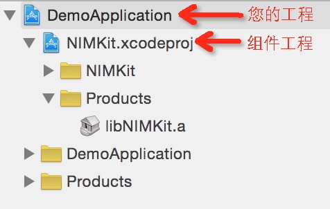
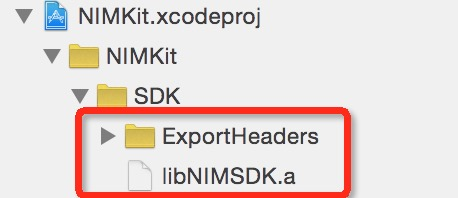
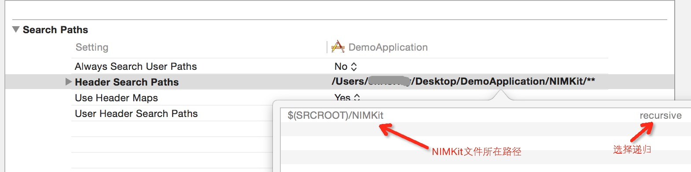

# 网易云信 组件工具包  NIMKit

##云信组件包  NIMKit 介绍

`NIMKit` 是一款可以帮助用户快速打造出聊天功能的UI组件，开发者可以通过一些简洁的代码，快速的实现聊天界面和最近联系人功能，并实现基础的一些定制化开发。 `NIMKit` 完全开源，如果开发者希望修改界面，只需要通过替换界面资源，修改配置等方式即可实现。如果开发者希望更深层次的自定义，也可自行修改代码。


##NIMKit说明

* `NIMKit` 依赖云信通讯能力库，在使用的时候请引入静态库 `NIMSDK`，以及相关头文件。
*    工程配置示例请参考 `NIMKitDemo\DemoApplication` 工程(请自行添加 `NIMSDK.a` )。
* 具体使用范例请参考 [NIM Demo For iOS](https://github.com/netease-im/NIM_iOS_Demo)。


##NIMKit文档

###基础使用


*  添加 `NIMKit` 到工程中（注意只需要添加xcodeproj文件即可） 添加后示例如图：

   


*  添加  `NIMSDK` 静态库 到 `NIMKit` 中，示例如图：
        
   


* 在您的工程中，添加必要的依赖项
	* CoreText.framework
	* CoreTelephony.framework
	* AVFoundation.framework
	* MobileCoreService.framework
	* SystemConfiguration.framework
	* AudioToolbox.framework
	* CoreMedia.framework
	* libstdc++6.0.9.tbd
	* libsqlite3.0.tbd
	* libz.tbd
	* libNIMKit.a

* 设置 `Other Linker Flags` 为 `-ObjC`

* 在 `Header Search Paths` 中添加 `NIMKit` 的文件路径，并设置为recursive。 示例如图：
  
  

	
* 在工程中添加 `NIMKitResouce.bundle`

* 在需要的地方导入头文件 `NIMKit.h`

* 新建一个 SessionViewController，从 NIMSessionViewController 进行继承 (此时运行将可以得到一个简单的会话界面)

###NIMKit基本体系架构
NIMKit 代替开发者实现了会话页和最近会话列表两个复杂界面。开发者只需要继承 NIMSessionViewController 和 NIMSessionListViewController ， 通过简洁的代码设置，即可在最短的时间内将聊天功能快速集成进App产品中。


###NIMKit内容提供

由于 NIMKit 并不关心业务逻辑信息，比如用户昵称，用户头像等。用户可以通过 NIMKit 单例向 NIMKit 注入一个内容提供类，通过这个内容提供类，NIMKit 才能够正确的进行业务逻辑数据的绘制。

开发者需要自定义一个提供类并实现NIMKitDataProvider协议

```objc
/**
 *  上层提供用户信息的方法
 *
 *  @param userId 用户Id
 *
 *  @return 用户信息
 */
- (NIMKitInfo *)infoByUser:(NSString *)userId;


/**
 *  上层提供群组信息的方法
 *
 *  @param teamId 群组id
 *
 *  @return 群组信息
 */
- (NIMKitInfo *)infoByTeam:(NSString *)teamId;
```

开发者可以在程序启动的时候，将实现类注入到 NIMKit 里。代码示例：

```objc
- (BOOL)application:(UIApplication *)application didFinishLaunchingWithOptions:(NSDictionary *)launchOptions {
    ...
    //这里的 NTESDataProvider 实现了 NIMKitDataProvider 协议
    [[NIMKit sharedKit] setProvider:[NTESDataProvider new]];
    ...
    return YES;
}

```

####内容变更通知
由于开发者应用的数据很多时候都是异步获取的（如用户信息可能从应用服务器请求获取），内容提供类在接收到 NIMKit 数据请求时，可能本地并没有数据，这个时候可以在回调里直接返回占位信息，如用户的昵称可以用 ID 代替，用户的头像可以用默认头像代替。等到数据请求回来时，调用 NIMKit 的通知接口，NIMKit  会自动刷新用户信息。

刷新接口

```objc
/**
 *  用户信息变更通知接口
 *
 *  @param userId 用户id
 */
- (void)notfiyUserInfoChanged:(NSString *)userId;

/**
 *  群信息变更通知接口
 *
 *  @param teamId 群id
 */
- (void)notfiyTeamInfoChanged:(NSString *)teamId;
```

代码示例：

```objc
- (NIMKitInfo *)infoByUser:(NSString *)userId{
    ContactDataMember *member = [[NTESContactsManager sharedInstance] localContactByUsrId:userId];
    if (member) {
        //如果本地有数据则直接返回
        NIMKitInfo *info = [[NIMKitInfo alloc] init];
        info.showName    = member.nick;
        info.avatarImage = [UIImage imageNamed:member.iconId];
        return info;
    }else{
        //如果本地没有数据则去自己的应用服务器请求数据
        [[NTESContactsManager sharedInstance] queryContactByUsrId:userId completion:^(ContactDataMember *member) {
            if (member) {
                //请求成功后调用通知接口刷新
                [[NIMKit sharedKit] notfiyUserInfoChanged:member.usrId];
            }
        }];
        //先返回一个默认数据,以供网络请求没回来的时候界面可以有东西展示
        NIMKitInfo *info = [[NIMKitInfo alloc] init];
        info.showName    = userId; //本地没有昵称，拿userId代替
        info.avatarImage = [UIImage imageNamed:@"DefaultAvatar"]; //默认占位头像
        return info;
    }
}
```


###自定义UI

####界面素材

NIMKit 中所有的资源都文件都是从 NIMKitResouce.bundle 读取，开发可以替换相应的素材以起到修改界面的效果。


###会话界面 NIMSessionViewController

####多媒体界面

NIMKit 提供一个自定义的多媒体面板，用户只需要实现 NIMSessionConfig 即可。SessionViewController 会在初始化进行查询。

```objc
- (NSArray *)mediaItems;

- (BOOL)shouldHideItem:(NIMMediaItem *)item;
```

####事件处理

目前 NIMKit 提供了多种多样的事件的，主要定义在 NIMInputActionDelegate 和 NIMMessageCellDelegate，子类只需要按需实现即可。

####参数配置

目前 NIMKit 提供如下的界面逻辑配置

* 是否禁用输入框

*   输入框面板菜单

* 最大输入长度

* 输入框place holder

* 消息分页条数

* 消息时间戳显示间隔

* 内置聊天气泡布局配置

* 自定义消息数据源

所有的配置项都可以在 NIMSessionConfig 中找到。


####自定义消息和MessageCell

######MessageCell结构


蓝色区域：为具体内容，如文字 UILabel ,图片 UIImageView 等。

绿色区域：为消息的气泡，具体的内容和气泡之间会有一定的内间距，这里为 contentViewInsets 。

紫色区域：为整个 UITableViewCell ，具体的气泡和整个cell会有一定的内间距，这里为 cellInsets 。

红色区域：为用户的头像。

#####NIMMessageModel
NIMMessageModel 为消息 ( NIMMessage ) 在NIMKit中的封装。这个封装主要是为了对计算结果和布局配置进行缓存，以避免反复的计算和读取相同的信息，从而提高应用性能。

NIMMessageModel 提供的初始化方法，可以很方便得由 NIMMessage 转换过来。

```objc	
- (instancetype)initWithMessage:(NIMMessage*)message;
```


#####内置MessageCell的自定义配置

使用云信用户可以自定义自己的消息格式，而同样的 NIMKit 也提供了不同消息类型的绘制方法。对于绝大部分自定义消息而言，用户并不需要关心内容区域外的界面(头像，昵称，气泡等)，只需要实现具体的内容承载控件即可，基于这个原则 NIMKit 提取了一个 NIMCellConfig 的协议。


在会话中，每种 message 都对应一个 NIMCellLayoutConfig，NIMSessionViewController 在生成 message 对应的 cell 时会询问子类是否有 当前 message 到 NIMCellLayoutConfig 的对应关系，如果没有则直接使用默认配置。

NIMCellLayoutConfig 中主要的方法有：

*  查询某个消息对应的ContentView类名

```objc
- (NSString *)cellContent:(NIMMessageModel *)model;
```

*  查询某个消息对应的内容区域的大小

```objc
- (CGSize)contentSize:(NIMMessageModel *)model cellWidth:(CGFloat)width;
```

*  cell气泡距离整个cell的内间距

```objc
- (UIEdgeInsets)cellInsets:(NIMMessageModel *)model;
```


*  cell内容距离气泡的内间距

```objc
- (UIEdgeInsets)contentViewInsets:(NIMMessageModel *)model;
```

*  是否显示头像

```objc
- (BOOL)shouldShowAvatar:(NIMMessageModel *)model;
```

*  是否显示姓名

```objc
- (BOOL)shouldShowNickName:(NIMMessageModel *)model;
```

*  是否显示语音未播放的红点

```objc
- (BOOL)shouldShowAudioPlayedStatusIcon:(NIMMessageModel *)model;
```


只要用户对自定义消息实现这2个接口就能够完整的实现一个 MessageCell 。需要注意的是返回的ContentView类必须是 NIMSessionMessageContentView 的子类。


当然用户也可以实现自己的 MessageCell这种方式自然是最为灵活，但也有代价：需要实现 NIMMessageCell 已实现的一些功能，并不推荐。


###最近会话列表界面 NIMSessionListViewController

与会话界面类似，新建一个 SessionListViewController ，从SessionListViewController 进行继承 (此时运行将可以得到一个简单的最近会话列表界面)。


#####最近会话列表配置
*  删除会话时是不是也同时删除服务器会话 (防止漫游)

```objc
@property (nonatomic,assign)   BOOL autoRemoveRemoteSession;
```

#####最近会话列表显示自定义
以下方法都有默认实现，开发者可以根据自己的需求自行定制重写某个或全部方法。
*  cell显示的会话名

```objc
- (NSString *)nameForRecentSession:(NIMRecentSession *)recent;
```
默认实现为，点对点会话，显示聊天对象的昵称(没有昵称则显示账号)；群聊会话，显示群名称。

*  cell显示的最近会话具体内容

```objc
- (NSString *)contentForRecentSession:(NIMRecentSession *)recent;
```
默认实现为：显示最近一条消息的内容，文本消息则显示文本信息，其他消息显示消息类型文案

 *  cell显示的最近会话时间戳
 
```objc
- (NSString *)timestampDescriptionForRecentSession:(NIMRecentSession *)recent;
```
默认实现为：最后一条消息的时间戳的格式化文案。


##联系人选择器 NIMContactSelectViewController
NIMKit 提供联系人选择器功能。支持选择用户或者群组，支持多选。

###初始化联系人选择器

开发者需要在初始化的时候通过传入配置器 `id<NIMContactSelectConfig>`，对联系人选择器进行配置。 NIMKit 预留了三种常用的配置，分别为：

1.选择好友 ` NIMContactFriendSelectConfig`

2.选择群  `NIMContactTeamSelectConfig`

3.选择群成员 `NIMContactTeamMemberSelectConfig`

开发者可在 `NIMContactSelectConfig.h` 中找到对应声明。

选择好友示例:

```objc
    NSMutableArray *users = [[NSMutableArray alloc] init];
    //使用内置的好友选择器
    NIMContactFriendSelectConfig *config = [[NIMContactFriendSelectConfig alloc] init];
    //获取自己id
    NSString *currentUserId = [[NIMSDK sharedSDK].loginManager currentAccount];
    [users addObject:currentUserId];
    //将自己的id过滤
    config.filterIds = users;
    //需要多选
    config.needMutiSelected = YES;
    //初始化联系人选择器
    NIMContactSelectViewController *vc = [[NIMContactSelectViewController alloc] initWithConfig:config];
    //回调处理
    vc.finshBlock = block;
```

###显示联系人选择器
创建完联系人选择器之后，调用 `-(void)show` 方法就可以弹出联系人选择器。

###联系人选择器回调

联系人选择器提供 `delegate` 和	 `block` 两种回调，可以根据业务需求自行选择监听方式。

##群名片
群名片分为普通群群名片 ` NIMNormalTeamCardViewController` 和 高级群群名片 `NIMAdvancedTeamCardViewController` 两种类型，初始化时传入需要展示的群组 `NIMTeam` 即可。
此组件意在为快速为开发者搭建一套可以直接使用的群名片，开发者可以根据需求自行修改组件源码。


