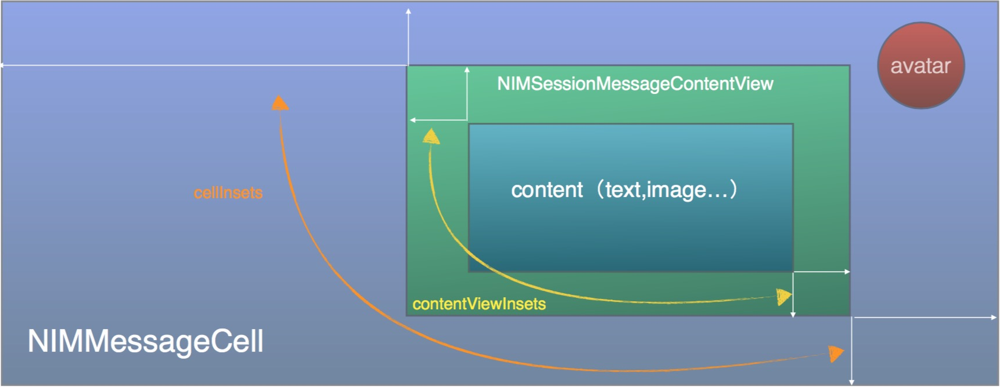

# 网易云信 组件工具包  NIMKit

## 云信组件包  NIMKit 介绍

`NIMKit` 是一款可以帮助用户快速打造出聊天功能的UI组件，开发者可以通过一些简洁的代码，快速的实现聊天界面和最近联系人功能，并实现基础的一些定制化开发。 `NIMKit` 完全开源，如果开发者希望修改界面，只需要通过替换界面资源，修改配置等方式即可实现。如果开发者希望更深层次的自定义，也可自行修改代码。


## NIMKit说明

* `NIMKit` 依赖云信通讯能力库 `NIMSDK`，请自行在您的工程中添加。
* 定制自定义消息教程 [NIM Guide For Custom Message](/NIM_Guide_For_Custom_Message.md) 。
* 利用组件绘制自定义消息气泡教程 [NIM Guide For Custom Message UI](/NIM_Guide_For_Custom_Message_UI.md) 。
* 工程配置和自定义消息配置示例请参考 `NIMKitDemo\DemoApplication` 工程 **(请自行在 DemoApplication/NIMSDK/ 下添加通讯能力库 libNIMSDK.a )**。
* 具体使用范例请参考 [NIM Demo For iOS](https://github.com/netease-im/NIM_iOS_Demo) 。


## NIMKit文档

### 基础使用


*  添加 `NIMKit` 到您自己的工程中。
*  添加 `NIMSDK` 到您自己的工程中，您可以选择手动添加或者使用 CocoaPods 导入。
*  在您自己的工程中，打开 `Build Phases` 选项，展开 `Link Binary With Libraries` 选项卡。添加必要的依赖项：
	* CoreText.framework

	如果您选择手动添加 NIMSDK ， 您还要添加以下依赖项：

	* CoreTelephony.framework
	* AVFoundation.framework
	* MobileCoreServices.framework
	* SystemConfiguration.framework
	* AudioToolbox.framework
	* CoreMedia.framework
	* libstdc++.6.0.9.tbd  <sup> 注<sup>1</sup> </sup><sup> 注<sup>2</sup> </sup>
	* libsqlite3.0.tbd  <sup> 注<sup>1</sup> </sup>
	* libz.tbd  <sup> 注<sup>1</sup> </sup>

  **注<sup>1</sup> ：在 XCode7 以上版本中后缀为 tbd , XCode6 及以下均为 dylib。**

  **注<sup>2</sup> ：请注意c++库的版本号，务必保证为 6.0.9 。**


* 设置 `Other Linker Flags` 为 `-ObjC`。

* 在工程配置 `info.plist` 文件中，添加条目 `NSAppTransportSecurity` ，属性设为 `Dictionary`。在此条目下添加键值对，key 为  `NSAllowsArbitraryLoads`, 值为 `YES`。

* 在工程中添加 `NIMKitResouce.bundle`。

* 在需要使用到组件的地方导入头文件 `NIMKit.h` 。

* 新建一个 SessionViewController，从 NIMSessionViewController 进行继承 (此时运行将可以得到一个简单的会话界面)。

### NIMKit基本体系架构
NIMKit 代替开发者实现了会话页和最近会话列表两个复杂界面。开发者只需要继承 NIMSessionViewController 和 NIMSessionListViewController ， 通过简洁的代码设置，即可在最短的时间内将聊天功能快速集成进App产品中。


### NIMKit内容提供

由于 NIMKit 并不关心业务逻辑信息，比如用户昵称，用户头像等。用户可以通过 NIMKit 单例向 NIMKit 注入一个内容提供类，通过这个内容提供类，NIMKit 才能够正确的进行业务逻辑数据的绘制。

开发者需要自定义一个提供类并实现NIMKitDataProvider协议

```objc
@protocol NIMKitDataProvider <NSObject>

@optional

/**
 *  上层提供用户信息的接口
 *
 *  @param userId  用户ID
 *  @param session 所在的会话
 *
 *  @return 用户信息
 */
- (NIMKitInfo *)infoByUser:(NSString *)userId
                 inSession:(NIMSession *)session;

/**
 *  上层提供用户信息的接口
 *
 *  @param userId  用户ID
 *  @param message 所在的消息
 *
 *  @return 用户信息
 */
- (NIMKitInfo *)infoByUser:(NSString *)userId
               withMessage:(NIMMessage *)message;

/**
 *  上层提供群组信息的接口
 *
 *  @param teamId 群组ID
 *
 *  @return 群组信息
 */
- (NIMKitInfo *)infoByTeam:(NSString *)teamId;


/**
 *  当消息作为提醒时(即会话里灰色的提示条)，需要显示的文本
 *
 *  @param message 消息
 *
 *  @return 显示文本
 */
- (NSString *)tipMessage:(NIMMessage *)message;

```

开发者可以在程序启动的时候，将实现类注入到 NIMKit 里。代码示例：

```objc
- (BOOL)application:(UIApplication *)application didFinishLaunchingWithOptions:(NSDictionary *)launchOptions {
    ...
    //这里的 NTESDataProvider 实现了 NIMKitDataProvider 协议
    [[NIMKit sharedKit] setProvider:[NTESDataProvider new]];
    ...
    return YES;
}

```

#### 内容变更通知
由于开发者应用的数据很多时候都是异步获取的（如用户信息可能从应用服务器请求获取），内容提供类在接收到 NIMKit 数据请求时，可能本地并没有数据，这个时候可以在回调里直接返回占位信息，如用户的昵称可以用 ID 代替，用户的头像可以用默认头像代替。等到数据请求回来时，调用 NIMKit 的通知接口，NIMKit  会自动刷新用户信息。

刷新接口

```objc
/**
 *  用户信息变更通知接口
 *
 *  @param userId 用户id
 */
- (void)notfiyUserInfoChanged:(NSString *)userId;

/**
 *  群信息变更通知接口
 *
 *  @param teamId 群id
 */
- (void)notfiyTeamInfoChanged:(NSString *)teamId;
```

代码示例：

```objc
- (NIMKitInfo *)infoByUser:(NSString *)userId
                 inSession:(NIMSession *)session
{
    BOOL needFetchInfo = NO;
    NIMSessionType sessionType = session.sessionType;
    NIMKitInfo *info = [[NIMKitInfo alloc] init];
    //填写默认值
    info.infoId   = userId;
    info.showName = userId;
    switch (sessionType) {
        case NIMSessionTypeP2P:
        case NIMSessionTypeTeam:
        {
            NIMUser *user = [[NIMSDK sharedSDK].userManager userInfo:userId];
            NIMUserInfo *userInfo = user.userInfo;
            NIMTeamMember *member = nil;
            if (sessionType == NIMSessionTypeTeam)
            {
                member = [[NIMSDK sharedSDK].teamManager teamMember:userId
                                                             inTeam:session.sessionId];
            }
            NSString *name = [self nickname:user
                                 memberInfo:member];
            if (name)
            {
                info.showName = name;
            }
            info.avatarUrlString = userInfo.thumbAvatarUrl;
            info.avatarImage = self.defaultUserAvatar;

            if (userInfo == nil)
            {
                needFetchInfo = YES;
            }
        }
            break;
        case NIMSessionTypeChatroom:
        //聊天室的Info不会通过这个回调请求
            NSAssert(0, @"invalid type");
            break;
        default:
            NSAssert(0, @"invalid type");
            break;
    }

    if (needFetchInfo)
    {
        //远程获取用户信息
        [self.request requestUserIds:@[userId]];
    }
    return info;
}
```


### 自定义UI

#### 界面素材

NIMKit 中所有的资源都文件都是从 NIMKitResouce.bundle 读取，开发可以替换相应的素材以起到修改界面的效果。


### 会话界面 NIMSessionViewController

### 会话结构漫游

* 概述

    `NIMSessionViewController` 继承 `UIViewController`，由 `UITableView`(界面)，`id<NIMSessionConfig>`(会话配置)， `NIMSessionMsgDatasource` (数据源) 作为基本构成。
    * 会话页结构

		```
		├── NIMSessionViewController  ＃核心会话类
		│   ├── NIMSession   # 所属会话
		│   ├── UITableView  # 聊天气泡聊表
		│   ├── NIMSessionViewLayoutManager # 布局管理器
		│   ├── NIMSessionConfig            # 会话参数配置协议
		│   │   ├── NIMCellLayoutConfig     # 消息的排版配置协议，默认配置为 NIMCellLayoutDefaultConfig , 可以继承这个类，并重写部分布局方法
		│   │   │   ├── # 气泡大小
		│   │   │   ├── # 气泡内容布局
		│   │   │   ├── # 是否显示头像
		│   │   │   ├── # 是否显示姓名
		│   │   │   └── # 气泡自定义控件
		│   │   ├── NIMKitMessageProvider   # 消息数据提供器协议
		│   │   │   ├── # 自定义消息数据源
		│   │   │   └── # 是否需要时间戳
		│   │   ├── # 输入按钮类型，录音，文本，表情，更多菜单等按钮，支持自定义顺序排列
		│   │   ├── # 更多菜单中的按钮定义 
		│   │   ├── # 自定义按钮禁用规则
		│   │   ├── # 文本输入长度限制
		│   │   ├── # 文本输入提示占位符
		│   │   ├── # 进入会话是否自动获取历史消息
		│   │   ├── # 会话中一次拉取的最大条数
		│   │   ├── # 消息之间时间戳的显示间隔
		│   │   ├── # 语音未读红点是否禁用
		│   │   ├── # 贴耳时，是否自动切换成听筒模式
		│   │   ├── # 录音类型和最大时长设置
		│   │   └── # 是否处理已读回执
		│   ├── NIMInputView     # 输入框
		│   └── UIRefreshControl # 下拉刷新控件
		```
    * 会话配置 
      
      需要重写 `NIMSessionViewController` 的 `- (id<NIMSessionConfig>)sessionConfig` 方法，返回一个实现 `id<NIMSessionConfig>` 协议的配置类。如果没有重写，或者返回的配置类里有一些配置方法没有实现，则会调用默认配置 `NIMCellLayoutDefaultConfig`。
    
      会话配置会在下一节作详细说明。

    * 数据源 

      `NIMSessionMsgDatasource` 包含两类数据模型，`NIMMessageModel` 和 `NIMTimestampModel`。 数据源会将 消息 `NIMMessaage` 包装成界面显示模型 `NIMMessageModel`，用来缓存一些布局信息来避免重复计算，如消息高度，内容大小等等；同时，由于有的消息距离上一条消息过久，需要在此之间显示一条时间。数据源会根据定义的间隔规则，计算出需要显示的时间模型 `NIMTimestampModel`，插在这两条消息中间。
    
      当消息显示时，首先会触发 `UITableViewDatasource` 的几个基本回调:

      ```objc
       - (CGFloat)tableView:(UITableView *)tableView heightForRowAtIndexPath:(NSIndexPath *)indexPath
      ```
      在这个回调中，会将数据源中的模型取出，如果模型中没有缓存 `cell` 的布局信息，则进行一次计算，并存入模型的缓存。

      ```objc
      - (UITableViewCell*)tableView:(UITableView *)tableView cellForRowAtIndexPath:(NSIndexPath *)indexPath
      ```
      
     在这个回调中，根据模型的种类复用 `NIMMessageCell` 或者 `NIMSessionTimestampCell` 来进行显示。 
     >      
     消息 `NIMMessageCell` 的几点说明：
     * `NIMMessageCell` 本质是由一个所有消息通用(如重试红点，头像)的视图和内容子视图 `NIMSessionMessageContentView` 构成的。
     * `NIMSessionMessageContentView` 是一个子视图的基类，所有消息的子视图都必须继承这个类。
     * 不同消息类型 `NIMMessageCell` 需要由不同的 `cellReuseIdentifier` 来方便复用，`cellReuseIdentifier` 即为内容子视图的类名。
     * `NIMSessionMessageContentView` 的具体实现子类名由协议 `NIMCellLayoutConfig` 中方法 `- (NSString *)cellContent:(NIMMessageModel *)model`返回。
  
     关于 `NIMMessageCell` 会在下一节做详细说明。
     
     对于内置的消息类型（如图片，语音，位置等消息）， `NIMKit` 已在 `NIMCellLayoutDefaultConfig`(实现了 `NIMCellLayoutConfig` 协议) 中定义。`NIMCellLayoutDefaultConfig` 将根据消息类型返回不同的消息配置。所有内置的消息配置都可以从 `NIMKit/Classes/Sections/Session/Config/` 目录下找到。
     
     内置的 `NIMSessionMessageContentView` 如下，在命名自己的子视图时，请注意不要重名。
     
     * NIMSessionTextContentView
     * NIMSessionVideoContentView
     * NIMSessionAudioContentView
     * NIMSessionFileTransContentView
     * NIMSessionImageContentView
     * NIMSessionLocationContentView
     * NIMSessionNetChatNotifyContentView
     * NIMSessionNotificationContentView
     * NIMSessionUnknowContentView
     
     
     对于开发者上层的自定义消息类型，开发者需要自己实现一个配置类并实现 `NIMCellLayoutConfig` 协议，并在 `cellContent:` 方法中返回此消息独有的 `cellReuseIdentifier` (见会话配置)。

* NIMMessageCell

    

    * 蓝色区域：为具体内容 ContentView，如文字 UILabel ,图片 UIImageView 等。

    * 绿色区域：为消息的气泡，具体的内容和气泡之间会有一定的内间距，这里为 contentViewInsets 。

    * 紫色区域：为整个 UITableViewCell ，具体的气泡和整个cell会有一定的内间距，这里为 cellInsets 。

    * 红色区域：为用户的头像。
    
 在刷新数据时，会调用方法并 `-(void)refresh` 将界面模型 `NIMMessageModel` 传入。
    
 当第一次调用这个方法（即不是复用生成），会调用 `- (void)addContentViewIfNotExist` 方法，根据 `NIMMessageModel` 找到对应的布局配置(如果找不到则按未知类型消息处理)。
 
 Tips：开发者在第一次接入的时候，可能由于协议实现不全或者注入布局配置有误等原因，导致消息在界面上显示为 `未知类型消息`，这个时候可以尝试从 `NIMMessageCell` 的 `- (void)addContentViewIfNotExist` 方法入手调试，查看`NIMMessageModel` 对应的布局配置以及协议的返回值是否正确。
    
* NIMSessionMsgDatasource

    会话数据源主要用于数据读取，在读取数据后会自动排序成界面需要的消息顺序，需要注意的是，会话数据源可以接受一个消息数据提供者 `NIMKitMessageProvider` ，用来显示不同来源的数据，默认不设置则读取本地数据。

    以 云信Demo 为例，在进入单人会话 `NTESSessionViewController` 时，读取的本地数据；当进入拉取服务器云端会话页 `NTESSessionRemoteHistoryViewController` 时，则将自己的配置改成 `NTESRemoteSessionConfig`，并在 `NTESRemoteSessionConfig` 的 `- (id<NIMKitMessageProvider>)messageDataProvider` 方法里返回了 `NIMRemoteMessageDataProvider`,即可用来显示云端记录。
    


#### 多媒体界面

NIMKit 提供一个自定义的多媒体面板，用户只需要实现 NIMSessionConfig 即可。SessionViewController 会在初始化进行查询。

```objc
- (NSArray *)mediaItems;

- (BOOL)shouldHideItem:(NIMMediaItem *)item;
```

#### 事件处理

目前 NIMKit 提供了多种多样的事件的，主要定义在 NIMInputActionDelegate 和 NIMMessageCellDelegate，子类只需要按需实现即可。

####参数配置

目前 NIMKit 提供如下的界面逻辑配置

|**是否禁用输入框** | **输入框面板菜单** |
|:----- | :-----|
|**最大输入长度** | **输入框place holder** |
|**消息分页条数** | **消息时间戳显示间隔** |
|**内置聊天气泡布局配置** | **自定义消息数据源** |
|**这次消息时候需要做已读回执的处理** | **是否需要处理已读回执** |
|**进入会话自动获取历史消息**   | **录音类型** |
|**是否禁用语音未读红点** | **是否禁用在贴耳的时候自动切换成听筒模式** |


所有的配置项都可以在 `NIMSessionConfig` 中找到。

开发者需要自定义一个配置类实现 `NIMSessionConfig` 中的配置方法，并注入到 `NIMSessionViewController` 的 `- (id<NIMSessionConfig>)sessionConfig` 方法中 (可由子类复写)。详细可参考 [NIM Demo For iOS](https://github.com/netease-im/NIM_iOS_Demo) 中的 `NTESSessionViewController` 类。

#####`NIMSessionConfig` 配置范例

```objc

@interface NTESSessionConfig()<NIMSessionConfig>

@end

@implementation NTESSessionConfig

/**
 *  可以显示在点击输入框“+”按钮里的多媒体按钮
 */
- (NSArray *)mediaItems
{
    // NTESMediaButtonPicture , NTESMediaButtonShoot 为 NIMMediaItem 的 tag 值，用来区分多个 NIMMediaItem 。

    return @[[NIMMediaItem item:NTESMediaButtonPicture
                    normalImage:[UIImage imageNamed:@"bk_media_picture_normal"]
                  selectedImage:[UIImage imageNamed:@"bk_media_picture_nomal_pressed"]
                          title:@"相册"],

             [NIMMediaItem item:NTESMediaButtonShoot
                    normalImage:[UIImage imageNamed:@"bk_media_shoot_normal"]
                  selectedImage:[UIImage imageNamed:@"bk_media_shoot_pressed"]
                          title:@"拍摄"],
}

/**
 *  是否隐藏多媒体按钮
 */
- (BOOL)shouldHideItem:(NIMMediaItem *)item
{
  return NO;
}

/**
 *  是否禁用输入控件
 */
- (BOOL)disableInputView
{
  return NO;
}

/**
 *  输入控件最大输入长度
 */
- (NSInteger)maxInputLength
{
  return 5000;
}

/**
 *  输入控件placeholder
 */
- (NSString *)inputViewPlaceholder
{
  return @"请输入消息";
}

/**
 *  一次最多显示的消息条数
 */
- (NSInteger)messageLimit
{
   return 20;
}

/**
 *  消息的排版配置，只有使用默认的NIMMessageCell，才会触发此回调
 */
- (id<NIMCellLayoutConfig>)layoutConfigWithMessage:(NIMMessage *)message
{
  //具体消息的排版配置，关于消息结构模型，请参考下一章节 自定义消息和 MessageCell 。
  id<NIMCellLayoutConfig> config;
    switch (message.messageType) {
        case NIMMessageTypeCustom:{
            if ([NTESSessionCustomLayoutConfig supportMessage:message]) {
               config = [[NTESSessionCustomLayoutConfig alloc] init];
               break;
            }
        }
        default:
            break;
    }
    return config;
}

@end

```


####自定义消息

#####内置MessageCell的自定义配置

使用云信用户可以自定义自己的消息格式，而同样的 NIMKit 也提供了不同消息类型的绘制方法。手把手教程可以参考如下：

* 定制自定义消息教程 [NIM Guide For Custom Message](/NIM_Guide_For_Custom_Message.md) 。

* 利用组件绘制自定义消息气泡教程 [NIM Guide For Custom Message UI](/NIM_Guide_For_Custom_Message_UI.md) 。


在会话中，每种 message 都对应一个 NIMCellLayoutConfig，NIMSessionViewController 在生成 message 对应的 cell 时会询问子类是否有 当前 message 到 NIMCellLayoutConfig 的对应关系，如果没有则直接使用默认配置。

NIMCellLayoutConfig 中主要的方法有：

*  查询某个消息对应的ContentView类名

```objc
- (NSString *)cellContent:(NIMMessageModel *)model;
```

*  查询某个消息对应的内容区域的大小

```objc
- (CGSize)contentSize:(NIMMessageModel *)model cellWidth:(CGFloat)width;
```

*  cell气泡距离整个cell的内间距

```objc
- (UIEdgeInsets)cellInsets:(NIMMessageModel *)model;
```


*  cell内容距离气泡的内间距

```objc
- (UIEdgeInsets)contentViewInsets:(NIMMessageModel *)model;
```

*  是否显示头像

```objc
- (BOOL)shouldShowAvatar:(NIMMessageModel *)model;
```

*  是否显示姓名

```objc
- (BOOL)shouldShowNickName:(NIMMessageModel *)model;
```


只要用户对自定义消息实现这2个接口就能够完整的实现一个 MessageCell 。需要注意的是返回的ContentView类必须是 NIMSessionMessageContentView 的子类。


当然用户也可以实现自己的 MessageCell这种方式自然是最为灵活，但也有代价：需要实现 NIMMessageCell 已实现的一些功能，并不推荐。


###最近会话列表界面 NIMSessionListViewController

与会话界面类似，新建一个 SessionListViewController ，从SessionListViewController 进行继承 (此时运行将可以得到一个简单的最近会话列表界面)。


#####最近会话列表配置
*  删除会话时是不是也同时删除服务器会话 (防止漫游)

```objc
@property (nonatomic,assign)   BOOL autoRemoveRemoteSession;
```

#####最近会话列表显示自定义
以下方法都有默认实现，开发者可以根据自己的需求自行定制重写某个或全部方法。
*  cell显示的会话名

```objc
- (NSString *)nameForRecentSession:(NIMRecentSession *)recent;
```
默认实现为，点对点会话，显示聊天对象的昵称(没有昵称则显示账号)；群聊会话，显示群名称。

*  cell显示的最近会话具体内容

```objc
- (NSString *)contentForRecentSession:(NIMRecentSession *)recent;
```
默认实现为：显示最近一条消息的内容，文本消息则显示文本信息，其他消息显示消息类型文案

 *  cell显示的最近会话时间戳

```objc
- (NSString *)timestampDescriptionForRecentSession:(NIMRecentSession *)recent;
```
默认实现为：最后一条消息的时间戳的格式化文案。


##联系人选择器 NIMContactSelectViewController
NIMKit 提供联系人选择器功能。支持选择用户或者群组，支持多选。

###初始化联系人选择器

开发者需要在初始化的时候通过传入配置器 `id<NIMContactSelectConfig>`，对联系人选择器进行配置。 NIMKit 预留了三种常用的配置，分别为：

1.选择好友 ` NIMContactFriendSelectConfig`

2.选择群  `NIMContactTeamSelectConfig`

3.选择群成员 `NIMContactTeamMemberSelectConfig`

开发者可在 `NIMContactSelectConfig.h` 中找到对应声明。

选择好友示例:

```objc
    NSMutableArray *users = [[NSMutableArray alloc] init];
    //使用内置的好友选择器
    NIMContactFriendSelectConfig *config = [[NIMContactFriendSelectConfig alloc] init];
    //获取自己id
    NSString *currentUserId = [[NIMSDK sharedSDK].loginManager currentAccount];
    [users addObject:currentUserId];
    //将自己的id过滤
    config.filterIds = users;
    //需要多选
    config.needMutiSelected = YES;
    //初始化联系人选择器
    NIMContactSelectViewController *vc = [[NIMContactSelectViewController alloc] initWithConfig:config];
    //回调处理
    vc.finshBlock = block;
```

###显示联系人选择器
创建完联系人选择器之后，调用 `-(void)show` 方法就可以弹出联系人选择器。

###联系人选择器回调

联系人选择器提供 `delegate` 和	 `block` 两种回调，可以根据业务需求自行选择监听方式。

##群名片
群名片分为普通群群名片 ` NIMNormalTeamCardViewController` 和 高级群群名片 `NIMAdvancedTeamCardViewController` 两种类型，初始化时传入需要展示的群组 `NIMTeam` 即可。
此组件意在为快速为开发者搭建一套可以直接使用的群名片，开发者可以根据需求自行修改组件源码。
